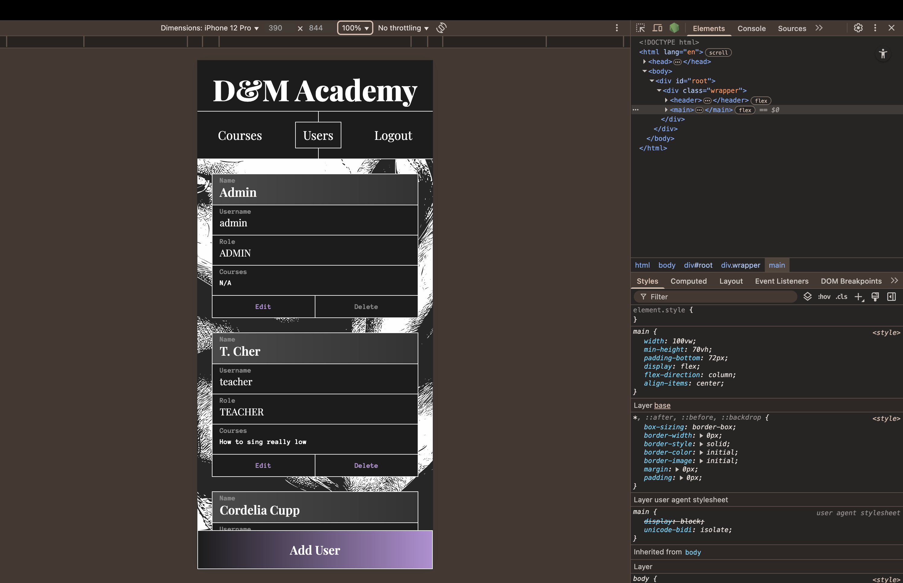
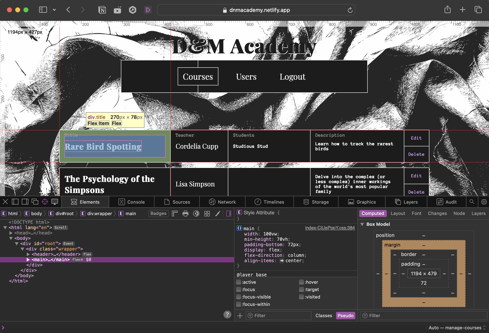
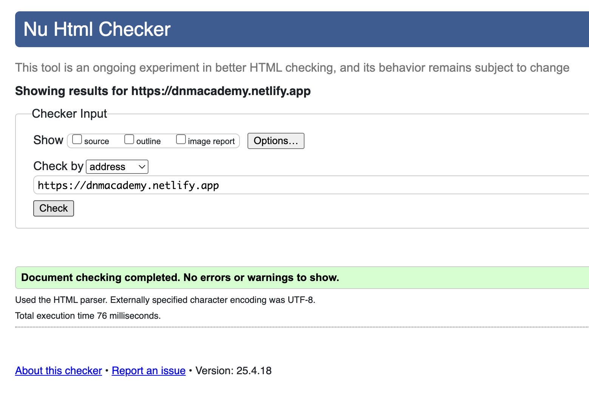
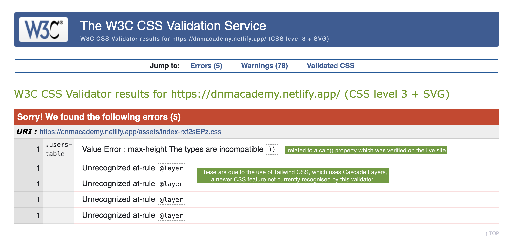
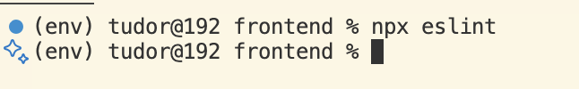
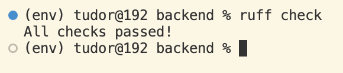
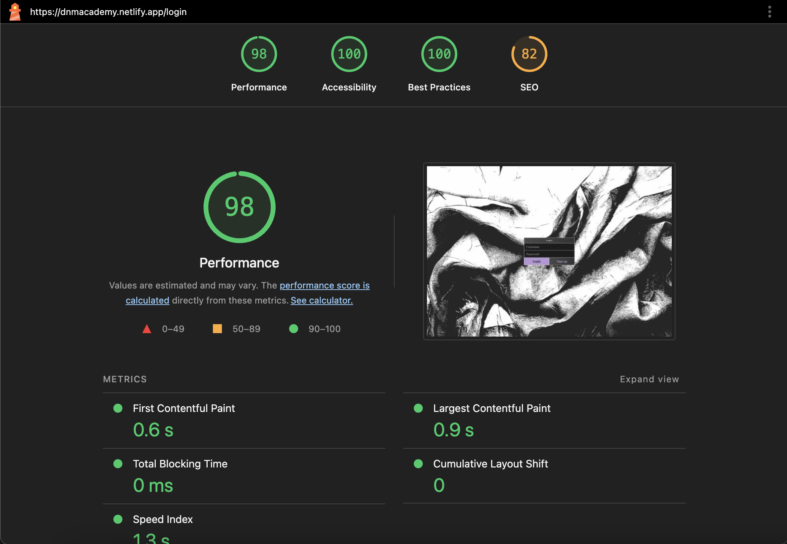

# ☯ D&M Academy

D&M Academy is a Learning Management System that allows users to register, log in, view, create, and enroll in courses. Built as a full-stack web application with Django REST Framework for the backend and React for the frontend, with JWT-based authentication.

Link to live site: [dnmacademy.netlify.app](https://dnmacademy.netlify.app/)

## 🚀 Features

- 🔐 User registration and JWT login  
- 👨‍🏫 Role-based system (Admin, Teacher, Student)  
- 📚 Course creation (teachers only)  
- 🧑‍🎓 Student enrollment  
- 🔄 Full CRUD functionality  
- 🖥️ Frontend built with React  
- 🌍 Backend served by Django REST API  

## 🧱 Tech Stack

### Frontend
- [React](https://react.dev/) to structure the app's frontend, handle routes, and dynamically update the DOM.
- [Vite](https://vite.dev/) to build the React app.
- [CSS](https://developer.mozilla.org/en-US/docs/Web/css) to add the styles and layout of the site.
- [Axios](https://axios-http.com/docs/intro) to send API requests and attach JWT tokens.

### Backend
- [Django](https://www.djangoproject.com/) to create and manage the database and API requests.
- [Django REST Framework (DRF)](https://www.django-rest-framework.org/) to create RESTful API routes.
- djangorestframework-simplejwt for JWT auth.
- [SQLite](https://sqlite.org/) is the database used for development.
- [PostgreSQL](https://www.postgresql.org/) is the database used for production.

## 🌐 Deployment

- **Frontend**: [Netlify](https://www.netlify.com/)  
- **Backend**: [Render.com](https://render.com/)  
- **Database**: [Render.com](https://render.com/)

## ⚙️ Local Setup

### 1. Clone the repository

```bash
git clone https://github.com/2d0r/dm-lms.git
cd dm-lms
```

### 2. Backend (Django)

```bash
cd backend
python -m venv env
source env/bin/activate  # On Windows use `env\Scripts\activate`
pip install -r requirements.txt
python manage.py migrate
python manage.py runserver
```

### 2. Frontend (React)

```bash
cd frontend
npm install
npm start
```

## 🧪 Running Tests

For frontend:
```bash
cd frontend
npm run test
```

For backend: 
```bash
cd backend
python manage.py test
```

## 👩‍🎓 User Stories
### First Time Visitor Goals

- As a first-time visitor, I want to easily understand the main purpose of the site and what it does.
- As a first-time visitor, I want to easily set up an account to browse the courses on this platform.
- As an admin and first-time visitor, I want to easily login with the admin credentials and easily manage the platform's content.

### Returning Visitor Goals

- As a returning student, I want to easily log in and browse the course I am enrolled in.
- As a returning teacher, I want to list the courses I oversee and easily edit their information.
- As a returning admin, I want to be able to manage existing users and courses, and create new ones.

### Frequent Visitor Goals

- As a student and frequent visitor, I want to keep track of new courses that might show up, enroll to ones that interest me, and unenroll from courses that don't interest me any longer.
- As a teacher and frequent visitor, I want to improve my music culture skills ahead of the weekly pub quiz.
- As a frequent visitor, I want to get my friends to have a go as well and see who gets the highest score.

### Target Audience

- People interested in learning quirky subjects.
- Professionals with unique skills ready to share them with others.

## ⚠️ Testing

### Compatibility

The website was tested for functionality, responsiveness and appearance, on Chrome and Safari web browsers, using in-built dev tools.
  - Chrome:
  

  - Safari:
  

### HTML
Passed validity with W3C.
<br>



### CSS
Passed validity check with W3C.
<br>



### Code linting
Linted JS and JSX using ESLint:
<br>



Linted Django using Ruff:
<br>



### Performance, accessibility, best practice and SEO.
Tested with Lighthouse.
<br>




## 🙋‍♂️ Author

Made with ❤️ by 2d0r